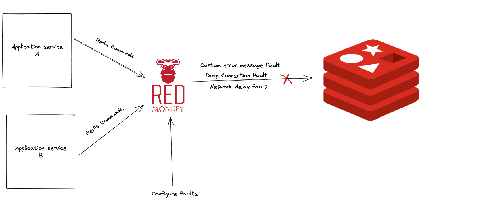

# red-monkey


`red-monkey` is a TCP proxy that can simulate faults against the Redis store. `red-monkey` can simulate three kinds of faults against Redis - `network delay`, `custom error response`, and `drop connection`.  

<p align="center">
  
</p>

## Why red-monkey? 
 
We believe systems could fail despite rigorous testing and the promise of 99.9% availability by cloud providers. Redis, a popular in-memory store that is used in various levels like caching, database and message-broker also can fail. So, we built a proxy (red-monkey) that can help you test the resiliency of your services against failures in Redis.


 

## How to build and run locally? 

### Prerequisites 

- Docker 

### Build 

```
make build 
```

### Run 

```
make run
```

### Run unit tests
```
make test 
```

### Run red-monkey with a Redis instance 

```
make compose-up
```

**Note:** The red-monkey service would point to the Redis instance that is created from the official Redis docker image. This can be useful for local development, testing, and for quick experiments with red-monkey. 


## Usage

### Environment variables

The docker environment variables can be configured in the `docker.env` file. 

1. `PROXY_PORT` is the proxy listener port through which the Redis requests are proxied to the origin Redis server. The default port is `6350`.
2. `REDIS_ADDRESS` is the address of the origin Redis server.
3. `IS_REDIS_TLS_CONN` is the boolean value that says whether to establish a TLS connection to the origin Redis server from `red-monkey`.
4. `FAULT_CONFIG_SERVER_PORT` is the port at which the fault configuration HTTP server listens. The default port is `8000`.
5. `LOG_LEVEL` represents the log level of red-monkey. The default log level is `info`. 

### Steps to fault test using red-monkey

- Point your app service to the red-monkey proxy instead of the Redis instance. 
- Run the red-monkey proxy by setting the right environment variables as mentioned in this [section](#environment-variables). 
- Configure faults in red-monkey (find some sample configurations [here](#fault-configuration)). Without any fault configurations set, red-monkey will simply proxy all the requests to the configured Redis instance. 
- Good luck testing the resiliency of your microservices against Redis failures! 

### Fault configuration

`red-monkey` runs an HTTP server that exposes API endpoints to configure faults. The fault configuration API schema can be found in the [swagger file](docs/swagger-fault-config-server.yaml). You can also find a [sample postman collection](docs/red-monkey.postman_collection.json) for a quick reference. The fault configurations are **stored in memory**. We will work on providing different fault storage options in the future. 

- The fault injection can be performed with respect to the Redis command. e.g. If the `GET` value is set in the `command` field, the fault will be applied only to the Redis `GET` command requests.  
- If a fault is desired to be applied to all the Redis commands, set `*` in the `command` field. The fault plan with the `*` will act as a fallback when no specific fault plans match. For example, when there is a specific fault plan for the `GET` command, it will be chosen over the fault plan with the `*` command for Redis `GET` request. When no specific fault plan matches, the fault plan with the `*` command will be applied.
- A command to fault is `1:1` mapped, meaning you can have only one fault mapped to command at any point in time. We are working to improve this situation, by bringing "percentage" into applying faults.    

**An example delay fault**

The unit of the `duration` field is millisecond.  

```
curl -X POST -H "Content-Type: application/json" \
    -d '{
        "name": "delay_err_set_cmd", 
        "description": "delay fault of 5 seconds for SET command",
        "fault_type": "Delay", 
        "duration": 5000,
        "command": "SET"
    }' \
    http://localhost:8000/fault
```

**An example custom error fault**

```
curl -X POST -H "Content-Type: application/json" \
    -d '{
        "name": "error_get_cmd", 
        "description": "return Invalid Key error for GET command",
        "fault_type": "Error", 
        "error_msg": "Invalid Key",
        "command": "GET"
    }' \
    http://localhost:8000/fault
```

**An example drop connection fault**

```
curl -X POST -H "Content-Type: application/json" \
    -d '{
        "name": "drop_conn_fault", 
        "description": "drop connection on all Redis commands",
        "fault_type": "DropConn", 
        "command": "*"
    }' \
    http://localhost:8000/fault
```


## Code of Conduct  

`red-monkey` is an open-source project and adheres to the [Contributor Convent Code of Conduct](CODE_OF_CONDUCT.md). By participating you are expected to uphold our Code of Conduct. We request our contributors and users to take a few minutes to review our Code of Conduct. 


## Contribution 

If you are interested in contributing to red-monkey through code, documentation, feature ideas, bug fixing, etc., use the [Issues](https://github.com/toyotaconnected-India/red-monkey/issues) section as the place to start the discussion. 


### License 

`red-monkey` is licensed under [Apache License 2.0](LICENSE).
