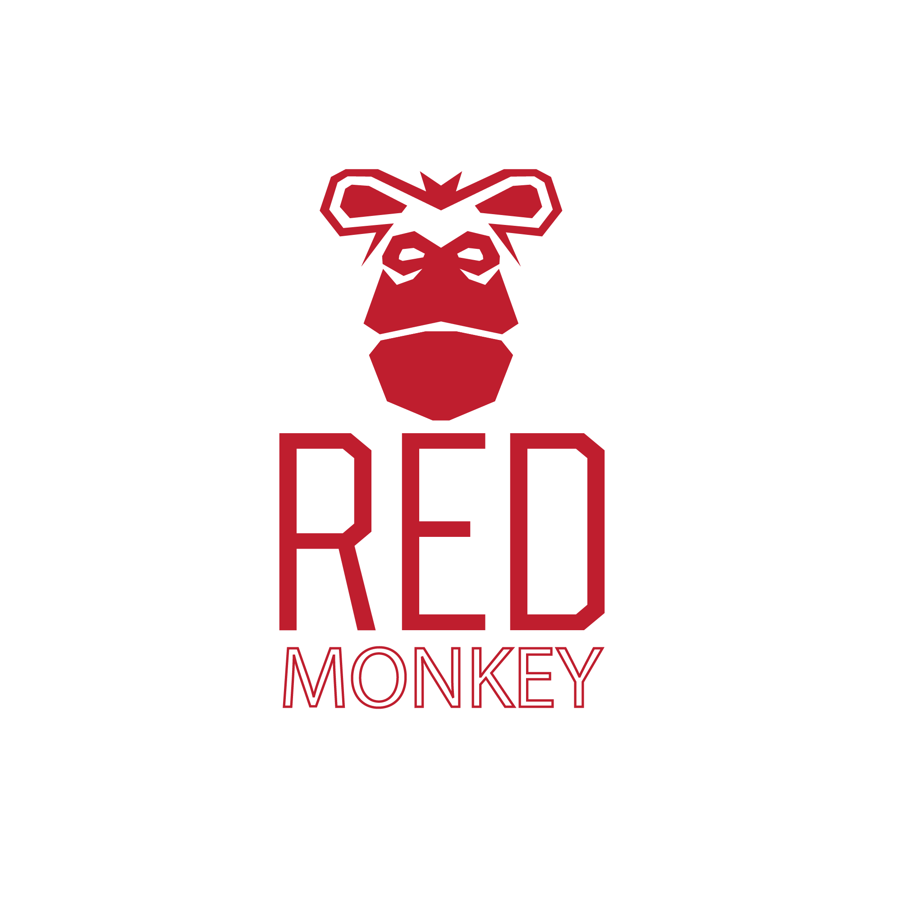

# red-monkey


`red-monkey` is a TCP proxy that can simulate faults against the Redis store. `red-monkey` can simulate two kinds of faults against Redis - `network delay` and `custom error response`.  

<p align="center">
  
</p>

## Why red-monkey? 
 
We believe systems could fail in spite of rigorous testing and the promise of 99.9% availability by cloud providers. Redis, a popular in-memory store that is used in various levels like caching, database and message-broker also can fail. So, we built a proxy (red-monkey) that can help you test the resiliency of your services against the network and custom error failures in Redis.
 
## How to build and run locally? 

### Build 

```
make docker-build 
```

### Run 

```
make docker-run
```

## Usage

### Steps to fault test using red-monkey

- Point your app service to the red-monkey proxy instead of the Redis instance. 
- Run the red-monkey proxy by setting the right environment variables as mentioned in this [section](#environment-variables). 
- Configure faults in red-monkey (find some sample configurations [here](#fault-configuration)). Without any fault configurations set, red-monkey will simply proxy all the requests to the configured Redis instance. 
- Good luck testing the resiliency of your microservices against Redis failures! 

### Environment variables

1. `PROXY_PORT` is the proxy listener port through which the redis requests are proxied to the origin Redis server. The default port is `6350`.
2. `REDIS_ADDRESS` is the address of the origin Redis server.
3. `IS_REDIS_TLS_CONN` is the boolean value that says whether to establish a TLS connection to the origin Redis server from `red-monkey`.
4. `FAULT_CONFIG_SERVER_PORT` is the port at which the fault configuration HTTP server listens. The default port is `8000`.
5. `LOG_LEVEL` represents the log level of red-monkey. The default log level is `info`. 

### Fault configuration

`red-monkey` runs an HTTP server that exposes API endpoints to configure faults. The fault configuration API schema can be found in the Swagger file [here](docs/swagger-fault-config-server.yaml). 

- The blast radius can be controlled using the `command` field. e.g. If the `GET` value is set in the `command` field, the fault will be applied only to the Redis `GET` command requests. If a fault is desired to be applied to all the Redis commands, set `*` in the `command` field. 
- The unit of the `duration` field is millisecond.  

**An example delay fault**

The following curl command sets a delay fault of 5 seconds for the Redis SET command. 

```
curl -X POST -H "Content-Type: application/json" \
    -d '{
        "name": "delay_err_set_cmd", 
        "description": "delay fault of 5 seconds for SET command",
        "fault_type": "delay", 
        "duration": 5000,
        "command": "SET"
    }' \
    http://localhost:8000/fault
```

**An example custom error fault**

The following curl command sets an error fault for the Redis GET command. As a result, the proxy will return `Invalid Key` error for the GET command.

```
curl -X POST -H "Content-Type: application/json" \
    -d '{
        "name": "error_get_cmd", 
        "description": "error fault for GET command",
        "fault_type": "error", 
        "error_msg": "Invalid Key",
        "command": "GET"
    }' \
    http://localhost:8000/fault
```

## Contribution

`red-monkey` is an open-source project. If you would like to contribute to red-monkey through code, documentation, feature ideas, bug fixing, etc., use the [issues](https://github.com/toyotaconnected-India/red-monkey/issues) section as the place to start the discussion. 


### License 

`red-monkey` is distributed under the terms of the MIT license. Check [MIT License](https://github.com/toyotaconnected-India/red-monkey/blob/main/LICENSE) for more details.
